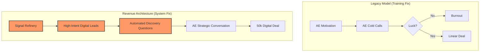

# The Working Model: Training vs. Architecture
**Prepared for Jassi Singh**
**Case Study**: NBC Universal (KNBC/KVEA)

---

## 1. The Choice: Two Different Products

Most clients (and most vendors) confuse **Skills** with **Systems**. This is the difference between asking Jassi to buy a "New Driver" vs. "A GPS-Guided Autonomous Golf Cart."

| Feature | Regular Sales Training (The Old Way) | Revenue Architecture (What We Build) |
| :--- | :--- | :--- |
| **Focus** | The **AE's Head** (Motivation & Skill) | The **Company's Engine** (Logic & Data) |
| **Outcome** | Improved "Confidence" | Fixed "Logic Leaks" |
| **Durability** | Decays over 90 days (Skills Gap) | Permanent Infrastructure (Revenue OS) |
| **Scaling** | Add more people to get more revenue | Fix the *ratio* to get more yield per AE |
| **Jassi's Role** | The Senior Coach | The Revenue Architect |
| **Pricing** | $5k - $15k per engagement | $50k - $250k Deployment |

---

## 2. The NBC "Signal-to-Close" Model

This is what we are *actually* deploying at NBC. We aren't just telling the 21 AEs to "go sell digital." We are building the machinery that makes it inevitable.

---

## 3. Why the $50k Price is the "Logical" Choice

If Jassi sells "Training," NBC compares him to a $199 LinkedIn Learning course.
If Jassi sells "Architecture," he is fixing the **$1M Revenue Leak** we identified in the audit.

**The Pitch to Kevin Keyes (NBC):**
> *"Kevin, you can spend $10k to tell your team to work harder, but they are still using a Linear map for a Digital city. We are building the Digital Map for them. Do you want to fix the reps, or do you want to fix the revenue?"*

---

## 🛠️ What We Are Building Right Now
Jassi, this isn't just theory. We have already built the "V1 Engine" for this:
1.  **[Diagnostic Brief](file:///Users/basin/Desktop/Basin & Associates 🌍/docs/nbc_digital_revenue_diagnostic_brief.md)**: The "Blueprint."
2.  **[Speculative Audit](file:///Users/basin/Desktop/Basin & Associates 🌍/Leon's Journal/01_Codex Hub/Speculative Audit - NBC Los Angeles.md)**: The "Leak Detector."
3.  **[Battle Card](file:///Users/basin/Desktop/Basin & Associates 🌍/Leon's Journal/01_Codex Hub/Battle Card - TalSmart NBC Strategic Sync.md)**: The "Command Center."

**This is the most sophisticated thing TalSmart has ever shipped. Jassi handles the 'Human Brain' (Neuroscience), and Leon handles the 'Machine Brain' (Revenue Architecture).**
